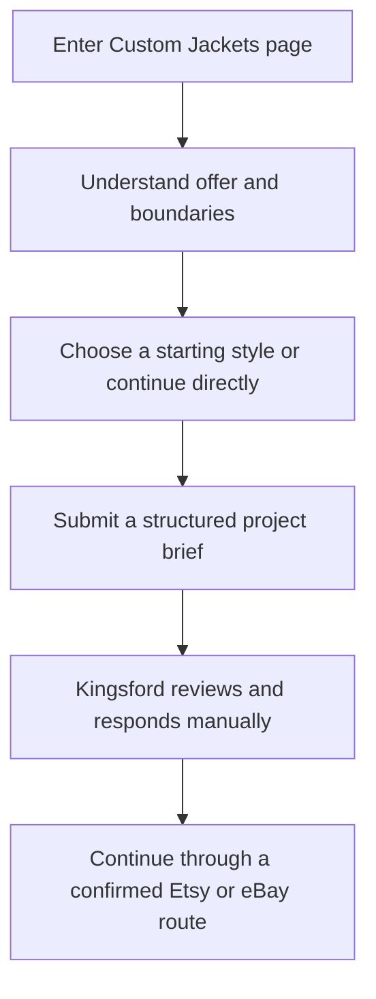

# Kingsford Leather Custom Jackets Page PRD and Implementation Plan

**Product:** Kingsford Leather custom-jacket enquiry experience  
**Repository:** https://github.com/Ruhan-AI/kingsford-leather  
**Current testing site:** https://lightcyan-rat-727672.hostingersite.com/  
**Competitor reference:** https://www.thejacketmaker.pk/pages/custom-jackets  
**Version:** 1.0  
**Status:** Ready for Antigravity implementation  
**Date:** 1 September 2026  
**Target route:** `/custom-jackets`  

## 0. Antigravity execution instruction

Implement this page inside the existing Kingsford Leather Next.js application. Do not create a new project, replace the current design system, or import a generic ecommerce template.

This is a page-specific extension of the approved premium white Kingsford experience. The current testing site is the visual source of truth for the global header, footer, typography, colors, button styling, page gutters, cards, motion, and responsive behavior. This document is the source of truth for the new Custom Jackets page.

Before editing code:

1. Read the repository rules and planning files in full.
2. Inspect `git status --short` and preserve unrelated user changes.
3. Identify the exact branch and commit deployed to the testing URL.
4. Branch from that verified implementation state, not from an older UI branch.
5. Create or reuse `feat/custom-jackets-page`.
6. Audit the current header, footer, buttons, containers, typography, product data, analytics, forms, and motion utilities before creating new components.
7. Reuse working Kingsford components and tokens. Do not duplicate the design system.

The competitor page is a reference for information hierarchy and conversion flow only. Do not copy its source code, text, images, customer reviews, client logos, product names, claims, exact section proportions, or exact visual compositions.

Run lint, type checking, relevant tests, and a production build after every implementation phase. Do not continue while a phase has TypeScript errors, hydration warnings, console errors, broken routes, or failing tests.

## 1. Locked product decisions

These decisions are mandatory:

1. Build a premium white-theme Custom Jackets page at `/custom-jackets`.
2. Match the current Kingsford site visually. The page must feel native to the existing homepage, not bolted on from another brand.
3. The primary conversion is a qualified custom-jacket enquiry submission.
4. The page is not a live product configurator. Visitors describe their requirements and Kingsford follows up manually.
5. Do not add an on-site cart, checkout, payment form, account, login, order tracker, customer dashboard, or admin dashboard.
6. Any confirmed purchase continues through an exact Etsy or eBay route supplied by Kingsford. Do not collect payment on the owned website.
7. AI try-on, virtual fitting, generated previews, body scans, photo-based visualization, and The Tailor's Docket remain completely removed.
8. Do not add a public image or file upload in P0. Reference images can be requested later through an approved support conversation.
9. Do not claim free worldwide shipping, no minimum order, guaranteed turnaround, specific size ranges, free samples, logo production, bulk capacity, made-to-measure availability, return eligibility, or response times until Kingsford verifies each claim in writing.
10. Render custom-work photography, reviews, client logos, and production proof only when authentic Kingsford assets and source records exist.
11. Preserve all existing products, slugs, prices, images, and Etsy/eBay URLs.
12. Use original Kingsford copy. Do not paraphrase the competitor so closely that the result feels copied.

## 2. Product summary

Kingsford needs a high-trust landing page for visitors who want a jacket adjusted around a personal brief, fit preference, team requirement, or an existing Kingsford silhouette. The page must explain what a custom request can involve, set realistic expectations, collect enough information for a useful first response, and create a clear path toward a marketplace transaction.

The page should combine the competitor's strongest conversion ideas with Kingsford's quieter premium visual identity. It must be easier to scan, less repetitive, and more factual than the reference.

### Primary user journey



### Primary conversion

Successful submission of the custom request form.

### Secondary conversions

- Visitor starts the form.
- Visitor chooses an existing Kingsford product as a starting point.
- Visitor opens the size guide or craftsmanship page.
- Visitor explores a relevant product or collection.
- Visitor clicks the Etsy or eBay store after reading the custom-order explanation.

## 3. Competitor page analysis

The competitor page was audited from top to bottom on 1 September 2026. Its visible content and interaction structure include the following.

| Competitor element | Conversion purpose | What works | Kingsford decision |
| --- | --- | --- | --- |
| Large collage hero | Establish variety and custom capability immediately | Strong visual proof and direct custom positioning | Use an original Kingsford split hero with authentic product and detail photography |
| Persistent `Design With Us` action | Keeps the primary conversion available during a very long page | Clear and consistent action | Adapt as a restrained leather-brown sticky CTA on desktop and a safe mobile bottom action |
| Consultation form near the top | Captures high-intent visitors without forcing a long read | Strong placement and useful qualification | Keep one structured Kingsford form immediately after the hero |
| Collection category grid | Helps visitors begin from a familiar garment type | Reduces blank-page anxiety | Use only categories represented in the real Kingsford catalogue |
| Four-item trust strip | Answers major objections quickly | Easy to scan | Replace competitor claims with verified Kingsford facts only |
| Logo-placement feature | Targets brands, teams, and corporate orders | Makes customization tangible | Render only after Kingsford verifies logo and bulk-order capability |
| Popular product rail | Connects the custom service to purchasable products | Gives users a concrete starting point | Use actual Kingsford products with `Use as a starting point` actions |
| Men, women, and unisex fit blocks | Clarifies fit pathways | Useful for diverse visitors | Adapt to Kingsford fit guidance without publishing unverified size ranges |
| Nine customization techniques | Shows breadth through image-led cards | Highly visual and specific | Use a smaller, factual customization matrix backed by real capability data |
| Six-step bespoke process | Reduces uncertainty about what happens next | Strong expectation setting | Use a Kingsford-specific process approved by the person who fulfills requests |
| Recent custom-work gallery | Provides concrete proof | Builds trust and inspiration | Conditional section. Hide it when authentic Kingsford project assets do not exist |
| Gallery modal with a repeated form | Converts interest from individual examples | Contextual CTA is useful | Do not repeat the entire form in every modal. Prefill the single page form instead |
| Customer reviews | Adds social proof | Helpful when reviews are traceable | Show only verified custom-order reviews with a marketplace source link |
| Client-logo wall | Signals scale and business credibility | Strong B2B trust cue | Do not render unless Kingsford has permission and proof for each logo |
| Large style index | Captures search demand and supports discovery | Broad SEO coverage | Use a concise set of real Kingsford silhouettes, not invented category pages |
| Extensive FAQ | Resolves pricing, sizing, shipping, order, and return objections | Useful late-stage reassurance | Publish only answers confirmed by Kingsford and marketplace policies |

### Competitor strengths to retain conceptually

- The primary enquiry action appears early and remains available throughout the page.
- Visitors can start from an existing style instead of describing everything from zero.
- Customization is explained visually rather than through one long paragraph.
- The process and FAQ reduce uncertainty before form submission.
- Custom work and reviews create proof when they are real.

### Competitor weaknesses to avoid

- The page is extremely long and repeats the full form inside many gallery modals.
- Sale prices and dense product merchandising compete with the custom-service story.
- Many broad claims require strong operational proof and should not be copied.
- The amount of category and SEO content makes the page feel less premium.
- The black floating action and mixed visual treatments would clash with Kingsford's white system.
- Repeated overlays increase complexity, keyboard-management risk, and mobile friction.

### Kingsford synthesis

Kingsford should use the same conversion logic, not the same design. The result should be approximately 9 to 12 focused sections, one source-of-truth form, authentic proof only, generous white space, warm ivory dividers, and restrained leather-brown actions.

## 4. Current Kingsford UI audit and consistency rules

The current testing site already establishes a strong premium white language. The Custom Jackets page must inherit it.

### Existing visual language to preserve

- White page canvas with warm ivory editorial surfaces.
- Dark ink text with muted warm-gray supporting copy.
- Leather-brown primary actions.
- Serif editorial headings and Manrope interface/body text.
- Square or lightly rounded imagery.
- Thin borders and very restrained shadows.
- Large vertical section spacing.
- Simple line icons.
- Editorial image-and-copy layouts rather than dashboard cards.
- Existing announcement bar, header, search, mobile drawer, and footer behavior.

### Existing design tokens

```css
:root {
  --color-canvas: #ffffff;
  --color-surface: #f8f6f2;
  --color-surface-strong: #efe9e1;
  --color-ink: #1c1a17;
  --color-text: #2c2925;
  --color-muted: #706a62;
  --color-line: #ded7ce;
  --color-leather: #8b5a35;
  --color-leather-dark: #5d3923;
  --color-tan: #c9a378;
  --color-success: #3f6548;
  --color-error: #9b3f38;
}
```

### Layout rules

- Maximum content width: `1440px`
- Reading width: `760px`
- Desktop gutters: `clamp(24px, 5vw, 80px)`
- Mobile gutters: `20px`
- Desktop section spacing: `96px` to `160px`
- Mobile section spacing: `64px` to `96px`
- Major radius: `8px` maximum
- Button radius: `4px`
- Form control minimum height: `48px`, recommended `52px`
- Touch target minimum: `44px` by `44px`
- Border: `1px solid var(--color-line)`
- Avoid heavy shadows, glass effects, gradients, oversized pills, and dark full-width sections

### Typography rules

- Display: existing Kingsford serif, preferably Cormorant Garamond if already configured
- Body and interface: Manrope
- H1: `clamp(2.75rem, 5vw, 5rem)`
- H2: `clamp(2.25rem, 4vw, 4rem)`
- H3: `clamp(1.5rem, 2.2vw, 2.25rem)`
- Body large: `clamp(1.05rem, 1.3vw, 1.25rem)`
- Body: `1rem`
- Small labels: `0.875rem`
- Eyebrows may use uppercase with `0.12em` tracking
- All main headings use sentence case
- Body text line length must remain below 70 characters where practical

## 5. Goals and measurable outcomes

### Business goals

- Create a dedicated entry point for custom-jacket interest.
- Improve the quality of enquiries by collecting the right brief information.
- Reduce repetitive back-and-forth before the first useful response.
- Connect custom requests to the existing Kingsford catalogue and marketplace model.
- Build trust without adding on-site commerce or operational complexity.

### Product targets

The site has no historical custom-page baseline. Treat these as post-launch evaluation targets, not existing performance claims.

| Metric | Initial evaluation target |
| --- | --- |
| Page visitor to form start | 12% or higher |
| Form start to successful submission | 45% or higher |
| Submission validation failure caused by UI defects | 0 |
| Duplicate submissions caused by repeated clicks | 0 |
| Incorrect product prefill | 0 |
| Lost form content after a recoverable server error | 0 |
| Mobile Lighthouse performance | 90 or higher |
| Lighthouse accessibility | 95 or higher |
| Cumulative Layout Shift | Under 0.1 |

Establish real baselines after launch. Do not fabricate conversion improvements.

## 6. Target users

### Individual custom buyer

Has a personal style, color, fit, or detail requirement and needs to know whether Kingsford can support it.

### Existing-product modifier

Likes a current Kingsford jacket and wants a variation in color, fit, lining, hardware, or other verified detail.

### Fit-conscious buyer

Needs a clearer route for measurements and fit guidance than a standard product listing provides.

### Gift buyer

Wants a more personal jacket but may not know the exact technical terms.

### Team or brand buyer

May need multiple pieces, logos, or consistent styling. This audience must only be actively marketed to when Kingsford confirms operational capacity.

## 7. Information architecture and navigation

### Required route

```text
/custom-jackets
```

Use one canonical route. Do not create duplicate `/custom`, `/bespoke`, or `/design-your-jacket` pages.

### Global navigation change

Add `Custom Jackets` as an internal navigation item.

Recommended desktop order:

```text
Shop | Men | Women | Custom Jackets | Craftsmanship | Guides
```

Also add the route to:

- Mobile navigation
- Footer Shop or Services column
- Relevant product-page size and fit block
- Craftsmanship page
- Size Guide page
- Sitemap

### Page-level navigation

Use a slim optional anchor bar after the hero on desktop:

```text
Overview | Starting points | Options | Process | FAQ
```

Rules:

- Hide the anchor bar on small mobile screens if it becomes crowded.
- Anchor links must account for the sticky global header.
- Active state may update through IntersectionObserver.
- No horizontal scroll trap.
- The primary `Start your request` action remains visually separated.

## 8. Page architecture

### Section map

| Order | Section | Purpose | Surface |
| --- | --- | --- | --- |
| 1 | Custom editorial hero | Establish offer and primary action | White |
| 2 | Custom request form | Capture a qualified brief early | Warm ivory band with white form |
| 3 | Start with a Kingsford silhouette | Reduce decision effort using real catalogue items | White |
| 4 | Verified trust strip | Set factual expectations | White with fine borders |
| 5 | What can be customized | Explain supported decision areas visually | White and ivory alternating cards |
| 6 | Fit pathways | Clarify men, women, unisex, or measurement routes | White |
| 7 | How the process works | Explain the manual custom journey | Warm ivory |
| 8 | Authentic custom work | Show proof only when real assets exist | White, conditional |
| 9 | Verified custom reviews | Add traceable social proof | White, conditional |
| 10 | Custom-order FAQ | Resolve objections without unsupported promises | Warm ivory or white |
| 11 | Marketplace clarity | Explain where payment and order management happen | White with border |
| 12 | Closing CTA | Return visitors to the single form | White or warm ivory |

### 8.1 Custom editorial hero

**Desktop layout**

- Two-column composition, approximately 44% copy and 56% imagery.
- Minimum visual height around `min(760px, calc(100svh - header))`.
- Copy aligns to the same left grid line as the current homepage hero.
- The right side uses an original two- or three-image composition with one dominant jacket image and one material or hardware detail.
- Use authentic Kingsford assets only.
- If no custom-project imagery exists, use current product, leather-detail, and craftsmanship assets. Do not fake a custom portfolio.

**Mobile layout**

- Copy first and imagery second.
- Keep the primary action visible within the initial viewport where possible.
- Use one strong 4:5 image rather than a crowded collage.
- Do not overlay long text on imagery.

**Recommended safe launch copy**

```text
Eyebrow: CUSTOM JACKETS BY KINGSFORD
Headline: A jacket shaped around your idea.
Body: Start with a Kingsford silhouette or tell us what you would like to change. Share the style, fit, and details you have in mind, and we will review the request with you directly.
Primary CTA: Start Your Custom Request
Secondary CTA: Explore the Options
Trust note: No payment is collected on this website.
```

The primary CTA scrolls to the form and moves focus to the form heading, not directly into an input.

### 8.2 Custom request form

Place the main form immediately after the hero. This is the only full form on the page.

**Desktop layout**

- Warm ivory section across the viewport.
- Inside the main container, use a 36/64 split.
- Left column: heading, short explanation, privacy note, and alternative contact link.
- Right column: white form panel with a thin border and maximum `8px` radius.
- Use a two-column field grid where related fields fit comfortably.
- Full-width message, consent, error summary, and submit action.

**Mobile layout**

- One column.
- Intro appears above the form.
- All fields are full-width.
- Native input types and large touch targets.
- Do not put the form in a modal.

See Section 9 for the complete schema and behavior.

### 8.3 Start with a Kingsford silhouette

Use six supported catalogue pathways selected from actual product data, for example:

- Biker
- Cafe Racer
- Bomber or Aviator
- Trucker
- Coat or Blazer
- Vest

Do not render a category with zero current products.

Each card includes:

- Authentic product or editorial image
- Silhouette name
- One concise factual line
- `Use as a starting point` action
- Optional `Explore styles` internal link

The starting-point action:

1. Sets `garmentType` or `baseProductSlug` in the form.
2. Scrolls to the form.
3. Announces the selected value to assistive technology.
4. Preserves all form values already entered.

Use four cards per row on large screens, two on tablet, and a two-column grid or horizontal snap rail on mobile. Do not use an inaccessible autoplay carousel.

### 8.4 Verified trust strip

Show three or four small proof points with 1.5px line icons. Safe topics include:

- Structured project brief
- Fit and measurement guidance
- Direct Kingsford follow-up
- Marketplace checkout clarity

Every statement must describe the actual workflow. Do not use competitor claims such as free worldwide shipping or no minimum order without evidence.

### 8.5 What can be customized

Use a six-card editorial matrix. A recommended launch set is:

1. Silhouette and length
2. Leather, suede, or verified material
3. Color and finish
4. Lining and interior details
5. Hardware, pockets, and closures
6. Fit and measurements

Optional capabilities, such as logos, embroidery, patches, custom labels, engraving, or bulk programs, must be feature-gated and hidden until verified.

**Card behavior**

- Image or detail crop occupies at least half the card.
- Title and two short lines of text remain visible without hover.
- Hover may reveal a subtle border or image scale of no more than `1.03`.
- Do not use white text over busy images unless contrast is guaranteed.
- Cards are informational, not fake configurator controls.

### 8.6 Fit pathways

Use three editorial panels:

- Men's fit direction
- Women's fit direction
- Unisex or custom measurement guidance

Do not publish fixed size ranges unless the data applies to the service and is approved. Each panel may link to the Size Guide and prefill the form's `fitProfile` value.

If made-to-measure is not verified, use `Fit guidance` rather than `Made to measure` in public copy.

### 8.7 How the process works

Use a clear numbered timeline. The recommended six-step model is:

1. Share your brief
2. Kingsford reviews the request
3. Confirm style, fit, and available details
4. Receive the approved scope and quote path
5. Complete the purchase through the confirmed marketplace route
6. Follow production and delivery updates through the agreed channel

The operations owner must approve these steps before launch. If steps 4 to 6 do not match the real process, replace them with the verified workflow.

**Desktop**

- Use a two-row three-column timeline or a left-aligned vertical timeline.
- Pair only real process photography with a step.
- Avoid a complex horizontal slider.

**Mobile**

- Use a vertical numbered list.
- Keep every description visible.

### 8.8 Authentic custom-work gallery

This section is conditional.

Render only when at least four authentic Kingsford custom-project images exist and Kingsford has permission to publish them.

Each gallery record requires:

- Stable ID
- Image and useful alt text
- Jacket type
- Verified customization summary
- Optional project type such as individual, gift, or team
- Publication approval status

Clicking an item may open an accessible lightbox with project facts and a `Start a similar request` action. That action closes the lightbox, prefills the single main form, and scrolls to it. Do not put another full form inside the lightbox.

If approved assets do not exist, omit the entire section with no empty placeholder.

### 8.9 Verified custom reviews

This section is conditional.

Requirements:

- Review is traceable to Etsy, eBay, or another approved public source.
- Review specifically relates to customization, fit support, or a custom order.
- Name usage is permitted.
- Display source and link where possible.
- Do not fabricate ratings, dates, or review counts.

Show a maximum of three reviews. If no suitable reviews exist, omit the section.

### 8.10 Custom-order FAQ

Use an accessible single-open or multi-open accordion. Recommended questions:

1. What details can I request?
2. Can I begin with an existing Kingsford jacket?
3. How do I share reference images?
4. How are measurements handled?
5. Where will I complete payment?
6. How long will a custom request take?
7. How do shipping and returns work for a custom order?
8. Can Kingsford support team, logo, or multiple-piece requests?

Safe answer rules:

- Explain that available options vary by jacket and will be confirmed after review.
- Reference images are requested later through an approved support channel. The website has no public upload.
- Payment occurs only through the confirmed Etsy or eBay listing or store route.
- Timeline, shipping, and returns are confirmed for the specific request and marketplace listing.
- Hide the team or logo question if that service is not verified.

### 8.11 Marketplace clarity

Use a bordered white panel with two compact marketplace columns.

Explain:

- This page submits an enquiry only.
- The website does not collect payment.
- Price, availability, delivery estimate, and applicable policies are confirmed before purchase.
- Checkout and order management continue through the exact marketplace route supplied by Kingsford.

Include general Etsy and eBay store links as secondary actions. Do not imply that submitting the form creates an order.

### 8.12 Closing CTA

Use a quiet white or warm-ivory closing composition.

```text
Headline: Have a jacket idea in mind?
Body: Share the details you already know. We will help clarify the rest after reviewing your request.
Primary CTA: Start Your Request
Secondary link: Explore All Jackets
```

The primary CTA returns to the original form. Do not repeat the form.

## 9. Form requirements

### 9.1 Field schema

| Field | Type | Required | Rules |
| --- | --- | --- | --- |
| Full name | Text | Yes | 2 to 80 characters |
| Email | Email | Yes | Normalize and validate server-side |
| Phone or WhatsApp | Tel | No | 7 to 30 characters, no contact claim implied |
| Country | Select or combobox | Yes | Use an accessible country list |
| Request type | Radio/select | Yes | Individual, Gift, Team or Brand, Not sure |
| Quantity range | Select | Yes | Data-driven values approved by Kingsford |
| Garment type | Select | Yes | Actual Kingsford silhouettes plus Other |
| Fit direction | Radio/select | Yes | Men, Women, Unisex, Not sure |
| Starting product | Select/search | No | Populated from current product data |
| Customization interests | Checkbox group | No | Show only verified capabilities |
| Budget range | Select | No | Config-driven currency and bands |
| Target date | Date | No | Must not imply a guaranteed deadline |
| Project details | Textarea | Yes | 50 to 1500 characters |
| Privacy consent | Checkbox | Yes | Links to Privacy page |
| Website | Honeypot | Hidden | Reject when populated |

Do not include file upload, body measurements, payment information, home address, government ID, or other unnecessary sensitive data.

### 9.2 Recommended data type

```ts
export type CustomRequestType =
  | "individual"
  | "gift"
  | "team-brand"
  | "not-sure";

export type FitProfile = "men" | "women" | "unisex" | "not-sure";

export interface CustomJacketRequestInput {
  fullName: string;
  email: string;
  phone?: string;
  country: string;
  requestType: CustomRequestType;
  quantityBand: string;
  garmentType: string;
  fitProfile: FitProfile;
  baseProductSlug?: string;
  customizationInterests: string[];
  budgetBand?: string;
  targetDate?: string;
  projectDetails: string;
  consent: true;
  sourcePath: "/custom-jackets";
}
```

The server creates `requestId`, `submittedAt`, and internal metadata. Do not accept those values from the client.

### 9.3 Interaction states

Required states:

- Untouched
- Focused
- Completed
- Field error
- Form error summary
- Submitting
- Successful
- Recoverable server error
- Rate-limited

Rules:

- Validate on blur where useful and always on submit.
- Show errors beside the field and in a linked error summary.
- Move focus to the error summary after a failed submission.
- Disable duplicate submission while a request is pending.
- Keep entered values after a recoverable failure.
- Do not show success until the server confirms provider acceptance.
- On success, replace the form body with a clear confirmation and request ID.
- Do not promise a response time unless a real service-level target is approved.
- Provide a verified contact fallback when submission fails repeatedly.

### 9.4 Submission architecture

Recommended P0 approach:

1. Client submits JSON to `POST /api/custom-requests`.
2. Route Handler validates with Zod.
3. Reject honeypot and invalid origin attempts.
4. Apply durable rate limiting.
5. Verify Turnstile or the approved anti-bot control.
6. Create a non-guessable request ID.
7. Send a structured notification email to the configured Kingsford inbox.
8. Send a minimal acknowledgement email to the visitor if the provider supports it reliably.
9. Return a typed success or error response.

P0 should not add a database or admin dashboard. If a CRM or database is added later, it requires a separate retention, access-control, export, and deletion specification.

### 9.5 Suggested server-side modules

```text
src/lib/custom-requests/schema.ts
src/lib/custom-requests/rate-limit.ts
src/lib/custom-requests/mailer.ts
src/lib/custom-requests/request-id.ts
src/lib/custom-requests/sanitize.ts
```

### 9.6 Environment configuration

Use server-only environment variables for provider credentials. Suggested names:

```text
CUSTOM_REQUEST_RECIPIENT_EMAIL
CUSTOM_REQUEST_FROM_EMAIL
RESEND_API_KEY
TURNSTILE_SECRET_KEY
NEXT_PUBLIC_TURNSTILE_SITE_KEY
CUSTOM_REQUEST_RATE_LIMIT_NAMESPACE
```

Adapt names to the existing repository conventions. Do not expose private credentials through `NEXT_PUBLIC_`.

The production form must not be enabled until the receiving inbox, domain authentication, spam protection, privacy copy, and failure fallback are tested.

## 10. Content and capability model

Avoid scattering claims across JSX. Create a typed page-content model.

```ts
export interface CustomServiceCapabilities {
  singlePiece?: boolean;
  multiplePieces?: boolean;
  madeToMeasure?: boolean;
  logoBranding?: boolean;
  embroidery?: boolean;
  patches?: boolean;
  customLabels?: boolean;
  hardwareSelection?: boolean;
  liningSelection?: boolean;
  leatherSelection?: boolean;
}

export interface CustomPageContent {
  hero: {
    eyebrow: string;
    title: string;
    body: string;
  };
  capabilities: CustomServiceCapabilities;
  quantityBands: Array<{ value: string; label: string }>;
  budgetBands: Array<{ value: string; label: string }>;
  processSteps: Array<{
    id: string;
    title: string;
    body: string;
  }>;
  faq: Array<{
    id: string;
    question: string;
    answer: string;
  }>;
}
```

Rules:

- A missing or false capability must hide related cards, fields, and FAQ items.
- Do not infer capabilities from the competitor page.
- Avoid placeholder client logos and fake custom-work records.
- Every public claim needs an owner and source in the content audit.
- Form options and public copy must stay synchronized through the same configuration.

## 11. Image and asset specification

### Required launch assets

| Asset | Quantity | Preferred crop | Notes |
| --- | --- | --- | --- |
| Hero jacket image | 1 | 4:5 or 3:4 | Authentic Kingsford product or custom work |
| Hero detail image | 1 to 2 | 1:1 or 4:5 | Leather grain, seam, lining, or hardware |
| Silhouette images | Up to 6 | 4:5 | Pulled from actual catalogue |
| Customization details | Up to 6 | 4:5 or 1:1 | Only details Kingsford can support |
| Process images | 0 to 3 | 4:3 | Optional and authentic only |
| Custom project gallery | Minimum 4 | 4:5 | Conditional and publication-approved |

### Image rules

- Use `next/image` with correct `sizes`, width, and height.
- Keep product colors accurate.
- Use AVIF or WebP where the image pipeline permits.
- Preload only the true hero image.
- Lazy-load below-the-fold images.
- Provide meaningful alt text.
- Use empty alt text for decorative crops.
- Do not use AI-generated people, fake workshops, copied competitor photography, or marketplace images without usage rights.
- If an asset is unavailable, simplify the layout instead of using a fake placeholder.

## 12. Responsive specification

Test at minimum:

```text
375 x 812
390 x 844
430 x 932
768 x 1024
1024 x 768
1280 x 800
1440 x 900
1920 x 1080
```

| Area | Mobile | Tablet | Desktop |
| --- | --- | --- | --- |
| Hero | Copy then one image | Stack or 45/55 split | 44/56 split |
| Form | One-column fields | One or two columns based on width | 36/64 intro and form split |
| Starting styles | Two-column grid or snap rail | Two or three columns | Three or four columns |
| Customization cards | One column | Two columns | Three columns |
| Process | Vertical steps | Vertical or two columns | Three-by-two grid or vertical timeline |
| Gallery | Two columns | Three columns | Four columns |
| Sticky CTA | Bottom safe-area bar after hero CTA leaves view | Optional bottom bar | Compact right-edge or header-aligned action |

### Mobile sticky action

- Show only after the main hero CTA leaves the viewport.
- Hide when the form is visible or focused.
- Respect `env(safe-area-inset-bottom)`.
- Do not cover cookie controls, validation messages, or the footer.
- Label: `Start Custom Request`.
- Use the existing Kingsford primary button style.

## 13. Motion and interaction system

Reuse the site's existing GSAP and CSS transition conventions.

Recommended motion:

- Hero copy enters with 16px to 24px vertical movement and opacity.
- Hero images use a subtle clip or mask reveal.
- Section headings reveal once on entry.
- Process steps use a short stagger.
- Image hover scale is limited to `1.03`.
- Anchor navigation and form scrolling use native smooth behavior only when reduced motion is not requested.
- Sticky CTA enters with a short opacity and vertical transition.

Rules:

- Respect `prefers-reduced-motion` and show all final states immediately.
- Do not hijack scroll.
- Do not add a page preloader.
- Do not animate each character.
- Do not pin long sections.
- Do not autoplay galleries.
- Use CSS for button, border, and card hover states.
- Clean up GSAP contexts on unmount.

## 14. Component and file architecture

Adapt this map to the existing repository and reuse components that already exist.

```text
src/
  app/
    custom-jackets/
      page.tsx
      loading.tsx                 # only if genuinely useful
    api/
      custom-requests/
        route.ts
  components/
    custom-jackets/
      CustomHero.tsx
      CustomAnchorNav.tsx
      CustomRequestSection.tsx
      CustomRequestForm.tsx
      StartingStyleGrid.tsx
      VerifiedTrustStrip.tsx
      CustomizationMatrix.tsx
      FitPathways.tsx
      CustomProcess.tsx
      CustomWorkGallery.tsx
      CustomWorkDialog.tsx
      CustomReviews.tsx
      CustomFAQ.tsx
      MarketplaceClarity.tsx
      CustomClosingCTA.tsx
      MobileCustomCTA.tsx
  content/
    custom-jackets.ts
  lib/
    custom-requests/
      schema.ts
      rate-limit.ts
      mailer.ts
      request-id.ts
      sanitize.ts
    analytics.ts
    seo.ts
  tests/
    custom-requests.test.ts
    custom-jackets-page.test.tsx
  e2e/
    custom-jackets.spec.ts
```

### Rendering model

- Render the page and static content as Server Components by default.
- Use Client Components only for the form, product prefill, anchor active state, accessible dialog, sticky CTA, accordions if interactive, and motion islands.
- Keep starting-style and product data server-derived.
- Do not add a global state library.
- Use local state for the form and dialog.
- Use URL parameters such as `?product=<slug>` only for a valid product prefill.
- Ignore invalid prefill values safely.

## 15. Analytics requirements

Required events:

```text
view_custom_jackets
custom_primary_cta_click
custom_form_start
custom_style_select
custom_fit_select
custom_faq_expand
custom_form_submit
custom_form_success
custom_form_error
custom_marketplace_click
```

Recommended event properties:

```ts
{
  source: "hero" | "sticky" | "style-card" | "product" | "faq" | "closing";
  garmentType?: string;
  fitProfile?: "men" | "women" | "unisex" | "not-sure";
  baseProductSlug?: string;
  marketplace?: "etsy" | "ebay";
  errorType?: "validation" | "rate-limit" | "provider" | "network";
}
```

Privacy rules:

- Never send name, email, phone, country, message, budget text, or target date to analytics.
- Do not send arbitrary free text.
- Use an allowlist for analytics properties.
- `custom_form_success` fires only after the server confirms success.
- Do not fire duplicate success events after refresh.

## 16. SEO and structured content

### Metadata direction

Suggested title:

```text
Custom Leather Jackets | Kingsford Leather
```

Suggested description:

```text
Start a custom jacket request with Kingsford Leather. Choose a Kingsford silhouette, share your fit and detail preferences, and continue through a confirmed marketplace purchase route.
```

Refine the copy after capability approval. Do not claim services that are not visible and operational.

### Technical SEO

- Self-referencing canonical for `/custom-jackets`.
- Include the route in `sitemap.ts`.
- Add breadcrumbs: Home, Custom Jackets.
- Use one H1.
- Keep semantic H2 and H3 order.
- Link from the header, footer, relevant product pages, Size Guide, and Craftsmanship.
- Use `FAQPage` schema only for questions and answers visibly rendered on the page.
- Use `BreadcrumbList` schema.
- Organization schema should remain centralized at the site level.
- Do not add Product or Offer schema to the service page.
- Do not add AggregateRating without verified visible data.
- Do not create thin custom-style routes until each has unique content and real catalogue support.

## 17. Accessibility requirements

Target WCAG 2.2 AA.

- Include the existing skip-to-content link.
- Maintain one H1 and logical heading order.
- Form fields require persistent visible labels.
- Required fields must be identified in text, not color alone.
- Error messages must be programmatically associated through `aria-describedby`.
- Error summary links move focus to the relevant field.
- Success and server errors use an appropriate live region.
- Accordion buttons expose `aria-expanded` and `aria-controls`.
- Any gallery dialog traps focus, closes with Escape, and restores focus to its trigger.
- Starting-style selection is fully keyboard accessible.
- Sticky CTA does not obscure focused content.
- All controls have a visible focus state.
- Touch targets are at least 44px by 44px.
- Text and controls meet WCAG AA contrast.
- Page remains usable at 200% zoom.
- Reduced motion shows final content without delay.
- External links state that they open a marketplace in a new tab.

## 18. Performance requirements

- LCP under 2.5 seconds on representative mobile conditions.
- CLS under 0.1.
- INP under 200ms.
- Mobile hero target under 300KB where visual quality permits.
- Desktop hero target under 500KB where visual quality permits.
- Reserve all image dimensions.
- Do not load gallery lightbox code until needed.
- Do not ship a country-library bundle when a compact accessible dataset is sufficient.
- Keep form validation code scoped to the form.
- Load Turnstile only around the form.
- Avoid synchronous third-party scripts in the document head.
- Avoid a heavy carousel library.
- Use CSS grid and native scroll snap where appropriate.
- Inspect the route bundle before release.

## 19. Security and privacy

- Collect only fields defined in Section 9.
- Do not collect photos, body images, payment data, addresses, IDs, or exact body measurements in P0.
- Validate every field on the server.
- Treat client validation as convenience only.
- Sanitize text before inserting it into HTML email.
- Do not render visitor text as raw HTML.
- Enforce request body size limits.
- Validate request origin and content type.
- Add durable rate limiting and a honeypot.
- Use an approved anti-bot provider when configured.
- Store secrets server-side only.
- Keep provider errors out of public responses.
- Add a generic correlation ID for diagnostics.
- Update the Privacy page to explain form data purpose, processors, and contact route.
- Do not add indefinite database storage by default.
- Do not log full form payloads in production.
- Do not expose the receiving inbox in client JavaScript unless it is intentionally public.

## 20. Error and fallback behavior

### Form backend unavailable

- Keep entered data in the browser state.
- Show a calm error message and Retry action.
- Offer a verified contact fallback.
- Do not silently discard the brief.

### Invalid product prefill

- Ignore the invalid value.
- Render the form normally.
- Do not expose a stack trace or redirect to 404.

### No authentic gallery or reviews

- Omit those sections completely.
- Tighten section spacing so the page does not look unfinished.

### JavaScript unavailable

- Core content, process, FAQ answers, navigation, and marketplace links remain readable.
- Provide an ordinary contact link when the enhanced form cannot operate.

### Email acknowledgement failure

- If the internal Kingsford notification succeeded, do not create a duplicate request through automatic retry.
- Show the request ID and state that the request was received.
- Log only non-sensitive diagnostics.

## 21. Content verification gate

Before public launch, Kingsford must approve this matrix. Antigravity must hide any unverified item rather than guessing.

| Decision | Required evidence or owner approval | UI affected |
| --- | --- | --- |
| Single-piece custom orders | Operations confirmation | Request type, FAQ, trust copy |
| Multiple-piece or team orders | Capacity and quantity rules | Quantity field, team option, FAQ |
| Made-to-measure service | Measurement workflow | Fit cards, form interests, process |
| Available materials | Product or sourcing data | Customization cards and form |
| Logo, embroidery, patches, labels | Production capability | Optional capability cards and FAQ |
| Quote and payment workflow | Exact operational process | Process and marketplace clarity |
| Typical timeline | Written range and exceptions | FAQ and acknowledgement copy |
| Shipping and return handling | Marketplace policy source | FAQ and marketplace panel |
| Contact inbox and owner | Tested receiving route | Form backend |
| Customer acknowledgement | Approved email copy and sender | Form success flow |
| Custom project photography | Rights and project facts | Gallery |
| Custom-order reviews | Traceable source and usage approval | Reviews |
| Client logos | Written permission | Optional logo wall, not P0 |

## 22. Phased implementation plan

### Phase 0: Baseline and capability audit

**Tasks**

1. Confirm the deployed testing-site branch and commit.
2. Create or reuse `feat/custom-jackets-page` from that state.
3. Record existing `git status --short` and preserve unrelated work.
4. Run install, lint, type check, tests, and production build.
5. Capture current desktop and mobile screenshots of the homepage, header, footer, a collection page, and a product page.
6. Inventory reusable containers, buttons, headings, cards, accordions, analytics helpers, product data, and motion components.
7. Complete the capability matrix in Section 21 with the Kingsford owner.
8. Inventory approved page assets and source records.

**Deliverables**

- Baseline report
- Reusable-component map
- Approved capability matrix
- Asset inventory

**Exit gate**

- Existing app builds successfully.
- The exact deployed visual baseline is known.
- No unverified service claim is marked publishable.
- Form delivery owner and receiving inbox are confirmed.

**Suggested commit**

```text
chore: prepare custom jackets page baseline
```

### Phase 1: Content model, route, and page skeleton

**Tasks**

1. Add typed custom-page content and capability configuration.
2. Add `/custom-jackets` Server Component route and metadata.
3. Add breadcrumb and global navigation links.
4. Build the page container and all section placeholders using real component boundaries.
5. Add safe launch copy and hide unverified optional modules.
6. Add product prefill validation against the existing catalogue.

**Deliverables**

- Indexable route
- Correct navigation integration
- Typed content source
- Responsive section skeleton

**Exit gate**

- The route looks native to the existing site at all required widths.
- No duplicate header, footer, button, or container system is introduced.
- No competitor copy or asset is present.
- Production build succeeds.

**Suggested commit**

```text
feat: add custom jackets page foundation
```

### Phase 2: Hero, discovery, options, and process UI

**Tasks**

1. Build the responsive custom hero.
2. Build the page anchor navigation if it improves the final composition.
3. Build the starting-style grid from current product data.
4. Build the verified trust strip.
5. Build the customization matrix with capability gates.
6. Build fit pathways.
7. Build the approved process section.
8. Add restrained motion and reduced-motion behavior.
9. Add product and fit prefill interactions.

**Deliverables**

- Complete upper and middle page experience
- Data-backed style selection
- Approved process presentation

**Exit gate**

- All visible options are operationally supported.
- Product prefill is correct and accessible.
- Content remains complete without animation.
- No layout shift is caused by imagery.

**Suggested commit**

```text
feat: build custom jacket discovery experience
```

### Phase 3: Form backend and submission UX

**Tasks**

1. Implement the Zod schema and typed error response.
2. Build the accessible form and error summary.
3. Implement `POST /api/custom-requests`.
4. Add sanitization, body limits, origin checks, honeypot, rate limit, and anti-bot verification.
5. Implement the email provider adapter and approved templates.
6. Implement loading, success, provider failure, rate-limit, and retry states.
7. Add request ID generation and non-sensitive diagnostics.
8. Update Privacy content.
9. Test production-domain email authentication and delivery.

**Deliverables**

- Working secure enquiry pipeline
- Tested notification and acknowledgement delivery
- Accessible success and failure states

**Exit gate**

- Valid submissions reach the correct Kingsford inbox.
- Invalid or abusive submissions are rejected safely.
- Duplicate clicks do not create duplicate requests.
- Recoverable failures preserve visitor input.
- No sensitive data appears in analytics or production logs.

**Suggested commit**

```text
feat: add secure custom request workflow
```

### Phase 4: Conditional proof, FAQ, and closing conversion

**Tasks**

1. Add the authentic custom-work gallery only if approved records exist.
2. Add the accessible project dialog and form prefill action if the gallery ships.
3. Add verified custom-order reviews only if source records exist.
4. Build FAQ from approved answers.
5. Build marketplace clarity panel.
6. Build closing CTA and sticky desktop/mobile action.
7. Confirm spacing collapses correctly when optional sections are hidden.

**Deliverables**

- Complete lower-page conversion layer
- Conditional proof modules
- One-source-of-truth form behavior

**Exit gate**

- No fake proof or empty placeholders exist.
- Dialog and accordion work by keyboard.
- Sticky action never covers the form, footer, or focused content.
- All CTA sources reach the same form and preserve state.

**Suggested commit**

```text
feat: complete custom page proof and conversion flow
```

### Phase 5: SEO, analytics, accessibility, and performance

**Tasks**

1. Add canonical, sitemap entry, Open Graph metadata, breadcrumbs, and allowed schemas.
2. Add all approved analytics events with a strict property allowlist.
3. Run keyboard, focus, zoom, screen-reader-oriented, and reduced-motion checks.
4. Optimize image sizes, loading, and responsive `sizes`.
5. Inspect route bundle and remove unused client code.
6. Run Lighthouse at representative mobile and desktop widths.
7. Validate form emails do not expose injection or unsafe HTML.

**Deliverables**

- SEO-complete route
- Privacy-safe conversion analytics
- Accessibility and performance report

**Exit gate**

- No structured-data validation errors.
- Analytics contains no personal or free-text data.
- Lighthouse targets are met or exceptions are documented with evidence.
- WCAG 2.2 AA checks pass.

**Suggested commit**

```text
feat: finalize custom page seo and quality
```

### Phase 6: Final QA and release preparation

**Tasks**

1. Test the complete viewport matrix.
2. Test Chrome, Edge, Safari, and Firefox where available.
3. Test form success, validation, rate limiting, provider failure, retry, and duplicate-click scenarios.
4. Test every starting-style and product prefill.
5. Test with all optional sections enabled and disabled.
6. Test header, mobile drawer, footer, sticky CTA, anchors, FAQ, and gallery dialog.
7. Run final lint, type check, unit tests, end-to-end tests, and production build.
8. Compare screenshots with the current testing-site alignment rules.
9. Produce a release summary with changed files, environment requirements, test evidence, known limitations, and deployment steps.

**Exit gate**

- Definition of Done is satisfied.
- No placeholder text or temporary imagery remains.
- No console errors, hydration errors, broken links, or failed submissions remain.
- Deployment environment variables are documented without exposing values.
- Feature branch is ready for review.

**Suggested commit**

```text
chore: prepare custom jackets page release
```

## 23. Testing plan

### Unit tests

- Zod schema accepts valid requests.
- Every required field rejects missing or malformed values.
- Unexpected fields are stripped or rejected.
- Project details enforce length limits.
- Invalid product slugs are ignored or rejected as specified.
- Capability gates hide unsupported options.
- Request ID format is non-guessable.
- Email HTML escapes visitor content.
- Analytics allowlist drops personal fields.

### Component tests

- CTA focuses the correct form heading.
- Starting-style card prefills the expected field.
- Existing form values survive prefill changes.
- Error summary links focus invalid fields.
- Submit button prevents duplicate pending submissions.
- Success state displays request ID.
- FAQ exposes correct ARIA state.
- Gallery dialog restores focus.
- Sticky CTA hides while the form is visible.

### End-to-end tests

1. Visit `/custom-jackets` from desktop navigation.
2. Visit from mobile navigation.
3. Open with a valid `?product=<slug>` prefill.
4. Open with an invalid prefill.
5. Submit a valid request.
6. Trigger client and server validation errors.
7. Simulate provider failure and retry.
8. Simulate rate limiting.
9. Verify no duplicate request on double click.
10. Use the full journey with keyboard only.
11. Verify Etsy and eBay links and external-link attributes.
12. Verify FAQ schema matches visible FAQ content exactly.

### Manual visual checks

- Header, hero, section headings, buttons, borders, gutters, and footer match the testing site.
- White remains the dominant surface.
- Form controls feel like part of Kingsford's design system.
- Optional sections leave no awkward gaps when hidden.
- Long names, emails, project details, and localized country names do not break layouts.
- Error and success states are calm and premium.
- Mobile keyboard does not hide the focused field or sticky action.
- The page remains readable at 200% zoom.

## 24. Acceptance criteria

### Visual consistency

- Given the visitor arrives from the current Kingsford homepage, when `/custom-jackets` loads, then header, footer, typography, colors, gutters, buttons, borders, imagery treatment, and motion feel like the same website.
- Given a mobile viewport, when the page loads, then the layout is intentionally composed and not a squeezed desktop page.
- Given optional content is unavailable, when a conditional module is hidden, then spacing remains balanced and no placeholder appears.

### Conversion flow

- Given a visitor selects a starting style, when they choose `Use as a starting point`, then the correct form value is set and the form is brought into view without clearing other fields.
- Given a valid form, when submission succeeds, then one request is delivered, the form shows a request ID, and a success event fires once.
- Given a recoverable server error, when submission fails, then user input remains available and Retry is offered.
- Given a visitor reaches the closing CTA, when it is activated, then it returns to the original form rather than opening a duplicate form.

### Scope protection

- No AI try-on, photo upload, generated preview, body scan, or Tailor's Docket UI exists.
- No local cart, checkout, payment, account, dashboard, or order tracking exists.
- No unverified free shipping, MOQ, turnaround, size, return, sample, logo, bulk, or production claim appears.
- No competitor copy, photography, reviews, client logos, code, or exact layout is shipped.

### Quality

- All required widths pass without horizontal overflow.
- Keyboard and screen-reader-oriented checks pass.
- Lint, type check, tests, and production build pass.
- No form payload or personal field is sent to analytics.
- All marketplace and internal links are correct.

## 25. Risk register

| Risk | Impact | Mitigation |
| --- | --- | --- |
| Unverified custom capability is published | Trust and operational failure | Typed capability gates and owner sign-off |
| Form emails are lost or marked as spam | Missed revenue | Domain authentication, provider monitoring, delivery tests, fallback contact |
| Page looks copied from the competitor | Brand and legal risk | Reuse Kingsford system, original copy, original proportions, authentic assets |
| Very long page reduces completion | Conversion loss | Limit to focused sections, one form, concise copy, anchor navigation |
| Repeated CTAs create duplicate forms | UX and maintenance debt | One form ID and shared scroll/prefill helper |
| Spam overloads the inbox | Operational burden | Honeypot, durable rate limit, Turnstile, body limits |
| Personal data leaks into analytics or logs | Privacy risk | Event allowlist, server redaction, no payload logging |
| Custom imagery is unavailable | Weak proof layer | Use product and detail assets in hero, omit gallery until authentic work exists |
| Mobile sticky CTA covers content | Accessibility failure | Intersection logic, safe-area spacing, hide near form and footer |
| Existing redesign and new page diverge | Inconsistent brand experience | Branch from deployed baseline and reuse tokens/components |
| Marketplace workflow changes | Incorrect public explanation | Central content config and pre-release process review |

## 26. Definition of Done

The page is complete only when:

1. `/custom-jackets` is live and indexable.
2. Header, mobile navigation, footer, sitemap, Size Guide, Craftsmanship, and relevant product pages link to it.
3. It visually matches the current premium white Kingsford site.
4. The hero, form, starting styles, customization explanation, fit pathways, process, FAQ, marketplace clarity, and closing CTA are complete.
5. Optional gallery, reviews, logo, and bulk content render only with verified approved data.
6. The single form validates on client and server, resists spam, sends to the correct inbox, prevents duplicate requests, and provides accessible success and failure states.
7. No file upload or unnecessary sensitive-data field exists.
8. No on-site payment, cart, checkout, account, dashboard, or order system exists.
9. AI try-on and all related photo or visualization functionality remain absent.
10. Every public custom-service claim is approved and source-traceable.
11. Analytics measures the funnel without personal or free-text data.
12. SEO metadata, sitemap, canonical, breadcrumbs, and valid visible-content schemas are implemented.
13. WCAG 2.2 AA requirements are met.
14. Performance targets are met or evidence-backed exceptions are documented.
15. Lint, type check, tests, and production build pass.
16. No placeholder copy, fake proof, temporary images, broken links, console errors, or hydration warnings remain.
17. Release notes include environment setup, QA evidence, known limitations, and deployment instructions.

## 27. Ready-to-paste Antigravity master prompt

Copy the text below into Antigravity together with this complete PRD file.

```text
You are the senior product designer and Next.js engineer responsible for adding the Kingsford Leather Custom Jackets page to this existing repository:

https://github.com/Ruhan-AI/kingsford-leather

Read the attached "Kingsford Leather Custom Jackets Page PRD and Implementation Plan v1.0" in full and treat it as the source of truth for this page.

First identify the exact branch and commit represented by this current testing site:

https://lightcyan-rat-727672.hostingersite.com/

Branch from that verified state and create or reuse:

feat/custom-jackets-page

Inspect git status before editing and preserve unrelated work. Reuse the existing Kingsford header, footer, design tokens, typography, container, buttons, product data, motion utilities, analytics helpers, and accessibility patterns. Do not create a fresh project and do not import a template.

Build one new canonical route:

/custom-jackets

The competitor reference is:

https://www.thejacketmaker.pk/pages/custom-jackets

Use the competitor only to understand its conversion hierarchy: early consultation form, catalogue starting points, customization education, process explanation, authentic project proof, reviews, FAQ, and repeated access to the main CTA. Do not copy its code, copy, images, reviews, client logos, claims, product data, exact proportions, or exact layouts.

Locked requirements:

1. The page must use Kingsford's current premium white theme and feel completely native to the testing site.
2. The main conversion is a qualified custom-jacket enquiry.
3. Use one full form only. Every CTA scrolls to and optionally prefills that same form.
4. Add Custom Jackets to desktop navigation, mobile navigation, footer, sitemap, and relevant internal pages.
5. Use actual Kingsford products and categories as starting points.
6. Build typed capability flags. Hide any unverified service, form option, card, claim, FAQ, image, review, or logo.
7. Payment and order management remain on Etsy or eBay. Do not add on-site commerce.
8. Do not add a cart, checkout, payment form, account, login, customer dashboard, admin dashboard, order tracking, or inventory system.
9. AI try-on, virtual fitting, generated preview, body scan, photo visualization, and The Tailor's Docket are fully prohibited.
10. Do not add a public file or image upload in P0.
11. Do not publish claims about shipping, MOQ, turnaround, size ranges, samples, returns, bulk capacity, logos, or made-to-measure service without written approval captured in the capability audit.
12. Do not use fake custom-project photography, fake reviews, fake client logos, or AI-generated workshop/people imagery.

Implement the work in the seven PRD phases numbered 0 through 6:

0. Baseline and capability audit
1. Content model, route, and page skeleton
2. Hero, discovery, options, and process UI
3. Form backend and submission UX
4. Conditional proof, FAQ, and closing conversion
5. SEO, analytics, accessibility, and performance
6. Final QA and release preparation

At the end of each phase:

- Run lint, type checking, relevant tests, and a production build.
- Fix all errors before continuing.
- Verify mobile and desktop layouts.
- Make one logical commit using the suggested commit in the PRD.
- Record completed work, test results, and any verified limitation in a short implementation log.

Technical expectations:

- Keep the existing Next.js App Router, React, TypeScript, Tailwind CSS, and restrained GSAP architecture.
- Use Server Components by default and small client islands only for the form, prefill state, dialog, sticky CTA, accordion, active anchors, and motion.
- Build POST /api/custom-requests with server-side Zod validation, sanitization, body limits, origin checks, durable rate limiting, honeypot, approved anti-bot protection, non-guessable request IDs, and a tested email provider adapter.
- Do not add a P0 database or admin dashboard.
- Never log full form payloads and never send personal data or free text to analytics.
- Maintain WCAG 2.2 AA, reduced-motion behavior, responsive image optimization, and the performance budgets in the PRD.

Do not stop for routine implementation confirmation. Stop only if there is an unresolved risk to existing user work, the deployed source branch cannot be identified, the form delivery owner is missing, or a required service capability cannot be verified.

Final output must include:

- Complete source code on the feature branch
- Capability and content verification matrix
- Environment variable names without secret values
- Form delivery and failure-path test evidence
- Lint, type check, unit, end-to-end, and production-build results
- Desktop and mobile screenshots
- Accessibility and Lighthouse results
- Changed-file summary, known limitations, and deployment instructions
```

## 28. Reference notes

Research and visual alignment for this PRD used:

- [The Jacket Maker custom-jackets page](https://www.thejacketmaker.pk/pages/custom-jackets)
- [Kingsford Leather current testing site](https://lightcyan-rat-727672.hostingersite.com/)
- [Kingsford Leather repository](https://github.com/Ruhan-AI/kingsford-leather)

The reference site's ideas have been translated into an original Kingsford structure. No competitor content or proprietary asset should be shipped.
