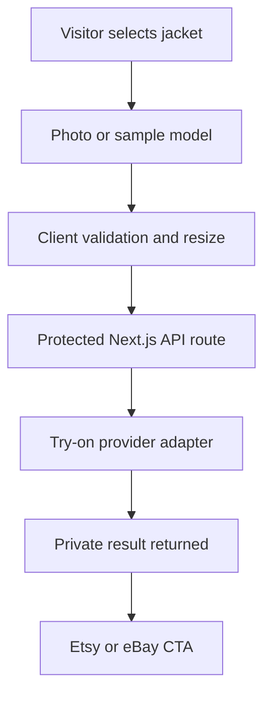

# Kingsford Leather Website Redesign and AI Virtual Try-On PRD

**Repository:** https://github.com/Ruhan-AI/kingsford-leather  
**Product:** Kingsford Leather brand and product discovery website  
**Version:** 2.0  
**Status:** Ready for implementation  
**Date:** 26 August 2026  
**Primary implementation agent:** Antigravity

## 0. Instruction to Antigravity

Work inside the existing `Ruhan-AI/kingsford-leather` repository. This is a redesign and feature upgrade of the current application, not a new project.

Before writing code, read these files in full:

1. `05-MEMORY.md`
2. `04-RULES.md`
3. `01-PRD.md`
4. `02-ARCHITECTURE.md`
5. `03-DESIGN.md`
6. `src/lib/products.ts`
7. `src/lib/site.ts`
8. The current home, collection, product, header, and footer components

This PRD changes the previous commercial model. It supersedes any earlier requirement for an on-site cart, checkout, account, Shopify backend, order dashboard, customer dashboard, or admin dashboard.

Build an original Kingsford Leather interface inspired by the premium structure and interaction quality of the Aniq UI ecommerce storefront. Do not copy its source code, text, brand, images, or exact layouts. Use the reference only for visual direction such as the floating navigation, cinematic hero, overlapping trust strip, editorial product sections, rounded panels, fitting-room drawer, restrained motion, and polished product presentation.

Do not commit directly to `main`. Use a feature branch such as:

```text
feat/marketplace-redesign-ai-try-on
```

## 1. Product decision

Kingsford Leather will remain a marketplace-led business for this version.

The website has four jobs:

1. Establish Kingsford as a premium and trustworthy leather brand.
2. Help visitors discover the right jacket or coat.
3. Let visitors visualize selected products on themselves through AI virtual try-on.
4. Send purchase-ready visitors to the exact Etsy or eBay listing.

The website will not accept payments, manage orders, hold a cart, or provide a customer dashboard. Etsy and eBay remain the transaction, buyer-protection, payment, and order-management layer.

## 2. Current repository audit

The current repository already provides a strong starting point:

| Area | Current state | Required change |
| --- | --- | --- |
| Framework | Next.js 15.5.23, React 19, TypeScript, Tailwind CSS 4 | Keep and upgrade only when safe |
| Catalogue | 49 consolidated products from Etsy and eBay | Preserve all verified products and marketplace URLs |
| Product routes | `/products/[slug]` | Redesign, keep URLs stable |
| Collection routes | `/men` and `/women` | Redesign and add useful URL-synced filters |
| Purchase model | External Etsy/eBay links already exist | Make marketplace conversion the only purchase path |
| Home signature feature | `TheDocket.tsx` measurement interface | Replace with AI Virtual Fitting Room |
| Header | Links to The Docket and Custom Measurement | Replace with AI Try-On and marketplace actions |
| Product sizing UI | Static size buttons and Docket links | Remove misleading local selection controls |
| Product gallery | Main image plus non-functional thumbnails | Build an accessible interactive gallery |
| Styling | Many hardcoded hex values in components | Move visual values into reusable design tokens |
| Motion | No GSAP package in `package.json` | Add a controlled GSAP motion system |
| Existing planning docs | Assume Shopify, cart, checkout, accounts, and dashboard | Rewrite to match this PRD |

Important content issue: the current home FAQ makes blanket leather claims while the catalogue contains multiple material types, including fabric. Product and FAQ copy must only make claims supported by each SKU. Do not state that every item is animal leather unless the complete catalogue has been verified.

## 3. Product vision

### Vision statement

Create a premium editorial storefront that feels modern, cinematic, and interactive while keeping Kingsford's workshop identity. A visitor should understand the craft, explore the collection, try a jacket on through AI, and reach the correct marketplace listing without encountering a fake cart or an unnecessary account flow.

### Positioning

**Handmade leather outerwear, direct from the maker, available through trusted marketplaces.**

The brand should feel personal and workshop-led, not like a large generic fashion catalogue.

### Primary conversion

An outbound click to the correct Etsy or eBay product listing.

### Secondary conversion

A successful AI try-on followed by an outbound marketplace click.

## 4. Goals and success metrics

### Business goals

- Increase qualified traffic sent to Etsy and eBay.
- Improve trust before the visitor leaves the owned site.
- Make AI try-on a practical conversion tool, not a decorative demo.
- Preserve the SEO value of owned product and collection pages.
- Keep the operational system simple by avoiding on-site commerce infrastructure.

### Product metrics

| Metric | Initial target |
| --- | --- |
| Product page to marketplace click-through rate | 18% or higher |
| AI try-on open rate on eligible product pages | 10% or higher |
| AI try-on completion rate | 55% or higher |
| Try-on result to marketplace click-through rate | 25% or higher |
| Mobile Lighthouse performance | 90 or higher |
| Accessibility score | 95 or higher |
| SEO score | 100 target |
| Broken or incorrect marketplace links | 0 |
| Core Web Vitals | All green |

Analytics must establish a baseline after launch. Do not fabricate pre-launch performance numbers.

## 5. Scope

### P0 launch scope

- Premium responsive redesign of the global shell, home page, collection pages, and product pages
- AI Virtual Fitting Room available from the home page, eligible product cards, and eligible product pages
- Product discovery with search, gender, category, material, and price filters
- Exact Etsy and eBay redirect buttons per product
- Outbound conversion analytics
- Updated brand, workshop, review, FAQ, marketplace, and trust content
- Technical SEO, Product structured data, breadcrumbs, sitemap, robots, Open Graph, and canonical tags
- WCAG 2.2 AA accessibility
- Mobile-first layout and reduced-motion support
- Privacy-safe processing of visitor photos
- Cost controls, rate limits, error handling, and feature kill switch for AI try-on

### P1 after launch

- Expand try-on eligibility from the initial top products to the remaining suitable garments
- Compare alternate try-on providers for leather detail fidelity
- Saved try-on looks in the current browser session only
- Shareable result only after a separate privacy review
- Product comparison
- Editorial leather and sizing guides
- Marketplace price and availability verification workflow

### Explicitly out of scope

- Admin dashboard
- Customer dashboard
- Shopify, Medusa, or custom commerce backend
- On-site cart
- On-site checkout
- Customer login or account
- Order history or order tracking
- Wishlist that requires an account
- Inventory management
- Payment processing
- Marketplace order synchronization
- User API key entry
- Permanent storage of visitor photos
- Native mobile app
- 3D body scanning
- Claims that AI preview shows exact size or fit

## 6. Target users

### User A: Style-led buyer

Wants to see whether a biker, cafe racer, bomber, shearling, or statement jacket suits their appearance before buying.

### User B: Fit-conscious buyer

Has concerns about proportions or has struggled with off-the-rack jackets. AI try-on helps with visual confidence, while actual measurements and customization are handled through the marketplace listing and seller communication.

### User C: Marketplace-trust buyer

Discovers Kingsford through search or social media but prefers Etsy or eBay buyer protection and checkout.

### User D: Gift buyer

Needs a clear product story, material information, visual reference, and a trusted purchase route.

## 7. Core UX principles

1. **The site informs and persuades. The marketplace completes the transaction.**
2. **Never imitate local commerce.** Do not show fake cart, quantity, checkout, stock selector, or size controls that do not carry into Etsy or eBay.
3. **AI try-on is a style preview, not a fitting guarantee.** Display this clearly wherever a result is shown.
4. **Every outbound button must open the exact product listing.** Never send a product-level CTA to a generic shop page when a verified listing exists.
5. **Trust must be factual.** Use only verified reviews, prices, material claims, shipping claims, and marketplace facts.
6. **The interface must work without motion.** Animation improves presentation but never controls access to content.
7. **Mobile comes first.** Assume most social and marketplace traffic arrives on phones.

## 8. Information architecture

### Required routes

| Route | Purpose |
| --- | --- |
| `/` | Brand home, featured products, AI try-on entry, trust, workshop, reviews |
| `/shop` | Full catalogue with search, filters, and sorting |
| `/men` | Men's catalogue landing page |
| `/women` | Women's catalogue landing page |
| `/collections/[category]` | SEO and browsing landing page for each product category |
| `/products/[slug]` | Product detail, try-on, product facts, and marketplace CTAs |
| `/try-on` | Dedicated full-page fitting-room fallback for mobile and direct links |
| `/our-story` | Brand and team story |
| `/craftsmanship` | Workshop, materials, and making process |
| `/leather-guide` | Material education |
| `/size-guide` | Measurement guidance and custom sizing instructions |
| `/shipping-returns` | Marketplace-specific expectations and links |
| `/contact` | Marketplace contact routes and general enquiry |
| `/privacy` | Site analytics and AI photo processing policy |
| `/terms` | Website terms and AI preview disclaimer |

Do not create `/cart`, `/checkout`, `/account`, `/admin`, or `/dashboard` routes.

## 9. Global navigation and shell

### Desktop header

Use a floating, rounded navigation bar inspired by the reference storefront but branded for Kingsford.

- Left: Home, Shop, Men, Women, Craftsmanship
- Center: Kingsford crest and wordmark
- Right: Search, AI Try-On, Etsy, eBay
- No account icon
- No cart icon
- No dashboard link
- Sticky after the hero crosses the viewport
- Compact on scroll without hiding navigation

### Mobile header

- Crest and wordmark on the left
- Search and menu on the right
- AI Try-On is a prominent item in the mobile drawer
- Etsy and eBay buttons appear near the bottom of the drawer
- Touch targets must be at least 44 by 44 pixels

### Global fitting-room trigger

Add a small floating pill labelled `Try it on` with a hanger icon. It opens the fitting room. It must not cover mobile browser controls or the sticky product CTA.

If the user opens it without selecting a product, show the eligible jacket selector first.

## 10. Home page architecture

The home page must feel editorial and premium. Avoid a repetitive grid-only ecommerce layout.

### Section 1: Cinematic hero

- Full-width rounded visual container under the floating navigation
- Real Kingsford product or workshop imagery
- Dark gradient overlay for legibility
- Eyebrow: `HANDMADE LEATHER OUTERWEAR`
- Main headline: `Handcrafted for Wild Roads & Cold Nights`
- Supporting line: direct-from-maker outerwear, available in standard or custom sizing through Etsy and eBay
- Primary CTA: `Explore the collection`
- Secondary CTA: `Try a jacket on`
- Optional small marketplace trust line below the CTAs

### Section 2: Overlapping trust strip

Four factual items inside a raised strip that partially overlaps the bottom of the hero:

1. Made to order
2. Standard or custom sizing
3. Tracked marketplace purchase
4. Direct from the workshop

Do not state free shipping globally. Current data confirms free shipping on Etsy, while eBay may use a separate shipping fee.

### Section 3: AI Virtual Try-On

This section replaces `TheDocket` completely.

- Heading: `See the jacket on you`
- Short explanation that the preview is AI-generated
- Product visual on one side
- Person/result comparison on the other side
- Three-step explanation: choose jacket, add photo or model, generate preview
- CTA: `Open fitting room`
- Supporting privacy line: photo is processed for the preview and is not saved to a public gallery
- Clear fit disclaimer

### Section 4: Why Kingsford

Use three large editorial cards, inspired by the reference store's structured brand cards:

1. `Direct` with workshop story
2. `Made for you` with standard and custom sizing explanation
3. `Built to last` with truthful material and construction information

Each card should use a different real product or workshop photograph and a restrained hover transition.

### Section 5: Featured edit

- One large editorial product feature
- Two smaller product cards
- Use a strong hierarchy rather than three equal cards
- Include price, material, category, AI hanger action when eligible, and `View product`
- Do not include Add to Cart

### Section 6: Shop by cut

Horizontal category cards for:

- Biker and moto
- Cafe racer
- Bomber and aviator
- Trucker and western
- Coats and trench
- Shearling
- Vests
- Statement pieces

### Section 7: New arrivals or curated collection

- Responsive product grid
- Product cards support image crossfade, price, material, marketplace availability, and try-on icon
- No invented ratings
- Use real review data only where it genuinely applies

### Section 8: From the workshop

- Large workshop or craftsmanship image
- Short direct copy about cutting, stitching, materials, and made-to-order production
- Link to `/craftsmanship`

### Section 9: Verified reviews

- Preserve marketplace attribution
- Show the real review count
- Do not imply reviews were collected directly on the website
- Link to verified Etsy or eBay review surfaces when available

### Section 10: FAQ and marketplace close

- Answer custom sizing, production time, materials, shipping, returns, and AI preview questions
- Final CTA band: `Found your jacket? Buy through the marketplace you trust.`
- Etsy and eBay buttons

## 11. Shop and collection pages

### Catalogue controls

- Search by product title and plain-language style terms
- Filter by gender
- Filter by category
- Filter by material
- Filter by price range
- Sort by featured, newest, price low to high, and price high to low
- Keep filters in the URL so filtered states can be shared and indexed where appropriate
- On mobile, place filters inside a bottom sheet or drawer

### Product cards

Every card must include:

- Product image with stable aspect ratio
- Product name
- Material
- Current CAD price
- Verified sale price only when present in product data
- `View product`
- Hanger icon when `tryOn.eligible` is true
- Small Etsy and eBay availability indicators

Do not include Add to Cart. Do not display ratings that are not product-specific and verified.

### Empty state

If filters return no products, explain which filters are active and offer a one-click reset.

## 12. Product detail page

### Desktop layout

- Left: interactive product gallery with main image, thumbnails, keyboard navigation, and optional zoom
- Right: product category, title, verified material, price, short description, try-on action, and marketplace actions
- Keep the right purchase panel sticky while the gallery scrolls

### Mobile layout

- Swipeable gallery
- Product title, material, and price immediately after the gallery
- `Try this jacket on` action
- Sticky bottom marketplace CTA
- If both marketplaces exist, open a small chooser or show two clearly labelled buttons

### Required actions

1. Primary revenue action: `Buy on Etsy` or `Buy on eBay`, using the exact listing URL
2. Secondary action: `Try this jacket on`, only for eligible products
3. If both marketplaces carry the product, show both choices without hiding either

### Remove from the current PDP

- Static local size buttons
- Quantity selector
- Add to Cart
- Checkout language
- `Fill Docket`
- Any selector that does not pass a selection to the marketplace

### Replace with

- `Sizing options` summary
- `How to order custom sizing` link to `/size-guide`
- Plain instruction that final size or personalization is selected or sent on Etsy/eBay
- Material and care accordions
- Production and delivery expectations with marketplace-specific wording
- AI preview disclaimer
- Related products

## 13. AI Virtual Fitting Room requirements

### Entry points

- Home AI Try-On section
- Global floating `Try it on` pill
- Hanger action on eligible product cards
- Product page button
- Dedicated `/try-on` page

### User flow

1. User selects a jacket, unless one is already selected.
2. User chooses `Use a sample model` or `Upload my photo`.
3. For an upload, show photo guidance before selecting the file.
4. User confirms they own the photo or have permission to use it.
5. Client validates and compresses the photo.
6. Server validates file type, size, dimensions, rate limit, and feature availability.
7. Server sends one person image and one approved garment image to the provider.
8. UI shows real progress states without a fake percentage.
9. Result appears in the fitting room with before and after comparison.
10. User can try another jacket, start over, download the result, or visit the exact Etsy/eBay listing.

### Photo guidance

- One person only
- Front-facing or slight three-quarter pose
- Upper body fully visible for jackets and coats
- Arms slightly away from the torso
- Even lighting
- Avoid heavy occlusion, group photos, and extreme crops
- Upload only your own photo or one you are authorized to use
- Do not upload photos of children

### Result experience

- Before and after comparison slider or side-by-side view
- Selected product title and material
- `Shop this jacket on Etsy`
- `View on eBay` when available
- `Try another jacket`
- `Use another photo`
- `Download preview`
- Disclaimer: `AI-generated style preview. Colour, drape, proportions, and actual fit may differ.`

### Failure states

- Unsupported image type
- File too large
- No clear person detected
- Multiple people detected
- Unsafe or disallowed content
- Product does not have a qualified garment image
- Rate limit reached
- Monthly budget reached
- Provider timeout
- Provider unavailable

Every failure state must explain the next useful action. The rest of the website must remain fully usable if AI try-on is unavailable.

### Privacy requirements

- Never ask visitors to paste their own provider API key
- Provider credentials remain server-only
- Do not place uploaded photos in a public CDN
- Prefer in-memory processing
- If temporary storage is technically required, use a private bucket and delete input and output within one hour
- Do not add photos or results to analytics, logs, Sentry, or session replay
- Do not use face recognition
- Do not use uploaded photos for model training
- Do not save results to an account because accounts are out of scope
- Update `/privacy` with the provider, purpose, retention, and deletion policy

### Cost controls

- One output image per generation for the MVP
- Default anonymous limit: 3 successful generations per device per day
- Secondary IP limit to reduce automated abuse
- Global monthly generation budget
- Google Cloud billing alerts
- Server-side feature flag and kill switch
- Cache only safe provider metadata, never a user's photo or generated likeness
- Do not charge for local validation failures

At the current official Google Cloud rate of US$0.06 per generated virtual try-on image:

| Successful generations | Approximate model cost |
| --- | --- |
| 1,000 | US$60 |
| 5,000 | US$300 |
| 10,000 | US$600 |

Hosting, analytics, monitoring, and any temporary storage are separate.

## 14. AI provider architecture

### MVP recommendation

Use Google Cloud Virtual Try-On through a server-side provider adapter.

Recommended current model configuration:

```text
Provider: Google Cloud
Model: virtual-try-on-001
Region: northamerica-northeast1
Output count: 1
```

Reasons:

- Purpose-built person plus garment workflow
- General availability
- Commercial cloud integration
- Predictable per-image pricing
- Canada region support
- The site does not need to ask the visitor for an API key

The current model documentation lists a retirement date of 20 January 2027. The application must therefore use an adapter and environment-controlled model ID. Do not couple UI components directly to one model name.

### Provider interface

```ts
export type TryOnInput = {
  personImage: Buffer
  garmentImage: Buffer
  mimeType: 'image/jpeg' | 'image/png'
  productId: string
}

export type TryOnOutput = {
  image: Buffer
  mimeType: 'image/jpeg' | 'image/png'
  providerRequestId?: string
  latencyMs: number
}

export interface TryOnProvider {
  generate(input: TryOnInput): Promise<TryOnOutput>
}
```

Create:

- `GoogleVirtualTryOnProvider`
- `MockTryOnProvider` for local automated testing only
- A provider factory controlled by server-only environment variables

FASHN can be evaluated later as an alternate provider. Its documentation positions Try-On v1.6 for faster ecommerce use and Try-On Max for higher-quality output, with Try-On Max taking about 50 seconds. Do not use a slow high-quality endpoint in the visitor flow without testing completion rate.

## 15. AI request architecture



### API route

Create a protected route such as:

```text
POST /api/try-on
```

Responsibilities:

- Accept multipart form data
- Validate the product ID against server-side product data
- Load the approved garment reference server-side
- Validate MIME type using file signatures, not only the extension
- Enforce size and image dimension limits
- Enforce rate limits and budget state
- Call the provider adapter
- Return the generated image without exposing provider credentials
- Emit safe operational metrics with no photo, face, or PII

Start with a synchronous request only if production testing confirms it stays safely within the hosting timeout. Otherwise implement an asynchronous job pattern with a short-lived opaque job ID and private temporary storage.

## 16. Product data changes

Preserve all existing IDs, slugs, Etsy URLs, eBay URLs, prices, and verified product facts.

Extend the existing product model:

```ts
type TryOnConfig = {
  eligible: boolean
  garmentImage?: string
  garmentCategory?: 'upper_body' | 'outerwear' | 'full_body'
  reasonUnavailable?: string
}

type Product = {
  // existing fields remain
  tryOn: TryOnConfig
  marketplaceVerifiedAt?: string
}
```

### Garment image rules

- Product-only or clean flat-lay image
- Front-facing
- Full garment visible
- Neutral or removed background
- No model body inside the garment image when a product-only photo is available
- No text overlays, watermarks, or collage layout
- Store an approved local or private source for AI use
- Do not rely on a third-party marketplace hotlink for production AI requests

Launch try-on for the best 12 eligible jackets first. Expand only after reviewing result quality across dark leather, suede, shearling, long coats, and statement details.

## 17. Technical architecture

### Stack

| Layer | Choice |
| --- | --- |
| Framework | Existing Next.js App Router |
| Language | TypeScript strict mode |
| Styling | Tailwind CSS 4 with semantic tokens |
| Motion | GSAP plus `@gsap/react` |
| Validation | Zod |
| AI provider | Google Cloud Virtual Try-On behind an adapter |
| Rate limiting | Upstash Redis or an equivalent server-side limiter |
| Analytics | GA4 plus optional Vercel Analytics |
| Error reporting | Sentry with aggressive PII scrubbing |
| Hosting | Vercel |

No database is required for the MVP because there are no accounts, orders, carts, or saved photos.

### Target component structure

```text
src/
  app/
    page.tsx
    shop/page.tsx
    men/page.tsx
    women/page.tsx
    collections/[category]/page.tsx
    products/[slug]/page.tsx
    try-on/page.tsx
    api/try-on/route.ts
    our-story/page.tsx
    craftsmanship/page.tsx
    leather-guide/page.tsx
    size-guide/page.tsx
    shipping-returns/page.tsx
    contact/page.tsx
    privacy/page.tsx
    terms/page.tsx
  components/
    layout/
      Header.tsx
      MobileMenu.tsx
      Footer.tsx
      SearchPalette.tsx
    sections/
      EditorialHero.tsx
      TrustStrip.tsx
      VirtualTryOnSection.tsx
      BrandPrinciples.tsx
      FeaturedEdit.tsx
      CategoryRail.tsx
      WorkshopStory.tsx
      MarketplaceCTA.tsx
    product/
      ProductCard.tsx
      ProductGallery.tsx
      ProductInfo.tsx
      MarketplaceButtons.tsx
      CollectionFilters.tsx
    try-on/
      FittingRoomProvider.tsx
      FittingRoomTrigger.tsx
      FittingRoomDrawer.tsx
      ProductPicker.tsx
      PhotoPicker.tsx
      PhotoGuidance.tsx
      GenerationProgress.tsx
      TryOnResult.tsx
      TryOnDisclaimer.tsx
    motion/
      gsap.ts
      HeroReveal.tsx
      SectionReveal.tsx
      ProductGridReveal.tsx
  lib/
    try-on/
      provider.ts
      google-provider.ts
      mock-provider.ts
      validation.ts
      image-processing.ts
      rate-limit.ts
      budget.ts
    analytics/
      events.ts
    seo/
      metadata.ts
      json-ld.ts
```

## 18. Design system

### Direction

Keep Kingsford's dark leather identity, but modernize the layout using the reference storefront's clean editorial hierarchy and soft panel geometry.

The result should feel like a premium independent label, not a dashboard and not a generic Tailwind template.

### Colour tokens

| Token | Suggested value | Use |
| --- | --- | --- |
| `night` | `#0E1011` | Main dark background |
| `charcoal` | `#181B1D` | Raised panels and header |
| `smoke` | `#262A2D` | Secondary surfaces |
| `parchment` | `#F1EEE8` | Light editorial sections |
| `bone` | `#E8E5DF` | Primary text on dark |
| `muted` | `#A7A39B` | Secondary text |
| `saddle` | `#B86F3F` | Primary action |
| `oxblood` | `#63252A` | Dark action hover and emphasis |
| `brass` | `#C79D59` | Fine accents and focus ring |

Move all colour, radius, spacing, and shadow values into semantic tokens. Do not leave hardcoded hex values scattered across JSX.

### Typography

- Preserve the Kingsford wordmark treatment for the logo
- Use a modern sans family for headings, body, and interface text
- Use weight and italic contrast in large editorial headings
- Keep line lengths readable
- Use no more than two text families plus the wordmark asset

### Geometry

- Maximum content width: 1440 pixels
- Floating header radius: 18 to 24 pixels
- Major content panels: 20 to 28 pixels
- Product cards: 16 to 20 pixels
- Buttons: rounded pill or 12 to 16 pixels depending on context
- Generous section spacing
- Mobile horizontal padding: 20 pixels

### Imagery

- Real product and workshop assets only
- No competitor assets
- No AI-generated people used as factual customer proof
- AI sample models may appear inside the clearly labelled fitting-room experience
- Use consistent aspect ratios to prevent layout shift
- Create local optimized AVIF or WebP derivatives for the website
- Retain high-quality approved PNG or JPEG garment references for the AI provider

## 19. Motion system

Add `gsap` and `@gsap/react`. Keep React Server Components as the default and isolate motion in small client leaves.

### Required motion moments

1. Hero headline reveal and slow image settle on initial load
2. Trust strip entrance after the hero content
3. Section or product-grid reveal as content enters the viewport

### Optional interaction motion

- Product-card image crossfade
- Category card expansion
- Fitting-room drawer slide and fade
- Before and after comparison handle
- Marketplace button arrow movement

### Rules

- Maximum three orchestrated motion moments per page
- Animate transform and opacity only
- Use `useGSAP` with a scoped ref and automatic cleanup
- Respect `prefers-reduced-motion`
- Never hide essential content in CSS while waiting for JavaScript
- No scroll hijacking
- No custom cursor
- No constant floating parallax
- No animation that delays marketplace actions

## 20. Marketplace conversion and analytics

### CTA behavior

- Etsy remains the primary button when a product exists on both platforms
- eBay remains clearly available as a secondary choice
- Buttons open in a new tab
- Use `rel="noopener noreferrer"`
- Display an external-link icon and marketplace name
- Track the click before navigation using a non-blocking event or `sendBeacon`

### Required events

```text
view_product
open_try_on
select_try_on_product
choose_sample_model
choose_photo_upload
start_try_on
try_on_success
try_on_error
download_try_on_result
outbound_marketplace_click
```

Safe event properties:

```text
product_id
product_slug
category
marketplace
page_location
try_on_used
error_code
latency_bucket
```

Never send photo URLs, image bytes, customer names, face attributes, or exact IP addresses to analytics.

## 21. SEO and structured data

- Keep all existing product slugs stable
- Add `/shop` and category pages without creating duplicate indexable combinations
- Use canonical URLs for product and collection pages
- Create Product JSON-LD with marketplace Offer URLs
- If both Etsy and eBay carry a product, use separate Offer entries
- Do not describe Kingsford's website as the checkout seller when the offer completes on a marketplace
- Do not hardcode an arbitrary `priceValidUntil`
- Do not claim free returns or free shipping in structured data unless verified for that exact offer
- Add BreadcrumbList on collection, guide, and product pages
- Add Organization schema using verified facts
- Use FAQPage only when the FAQ is visible on the page
- Generate sitemap entries for all product, collection, and guide pages
- Add descriptive alt text for human understanding
- Server-render all crawlable content
- Keep AI fitting-room controls out of structured data

## 22. Security, privacy, and abuse prevention

- All provider credentials are server-only
- Validate every API input with Zod
- Validate binary signatures for uploaded images
- Re-encode uploaded images before sending them to the provider
- Strip metadata such as EXIF and GPS coordinates
- Limit file size and dimensions
- Rate-limit by a privacy-preserving device token and hashed IP signal
- Set a strict Content Security Policy
- Do not log multipart bodies
- Do not include photo content in error monitoring
- Add `Cache-Control: no-store` on try-on requests and responses
- Add timeouts and abort signals to provider calls
- Use a global AI feature flag
- Return generic provider errors to the visitor and detailed non-PII codes to monitoring

## 23. Performance requirements

| Requirement | Target |
| --- | --- |
| LCP on mobile | Under 2.5 seconds |
| CLS | Under 0.1 |
| INP | Under 200 ms |
| Initial home JavaScript | Under 170 KB gzipped where practical |
| Hero image | Under 250 KB in the delivered mobile format |
| AI code | Lazy-loaded only when fitting room opens |
| Product images | Responsive AVIF/WebP with correct `sizes` |

The AI provider response time does not count as page LCP. The generation flow must remain responsive and cancellable.

## 24. Accessibility requirements

- WCAG 2.2 AA
- One clear H1 per page
- Full keyboard access to navigation, search, filters, gallery, fitting room, comparison slider, and marketplace chooser
- Focus trap and focus restoration for drawers and dialogs
- Visible brass focus ring
- Touch targets at least 44 by 44 pixels
- Status messages announced with `aria-live`
- Generation progress must not rely on animation alone
- Error meaning must not rely on colour alone
- Product card hanger buttons need descriptive accessible labels
- Reduced-motion mode must show the final visual state immediately

## 25. Implementation plan

### Phase 0: Documentation and baseline

**Output:** The repository accurately reflects the new product model.

- Create the feature branch
- Run the current typecheck and build
- Record existing issues before redesign
- Update `01-PRD.md`, `02-ARCHITECTURE.md`, `03-DESIGN.md`, and `05-MEMORY.md`
- Remove the unresolved Shopify backend decision because it no longer applies
- Record the new locked decision: marketplace-led website with AI try-on
- Add a migration checklist for The Docket removal

**Acceptance:** No planning document tells an implementation agent to build cart, checkout, accounts, or dashboard.

### Phase 1: Design foundation and shell

**Output:** New visual system, header, footer, search shell, and motion primitives.

- Add semantic Tailwind tokens
- Replace component-level hardcoded colours
- Add GSAP packages and scoped helpers
- Build floating responsive header
- Remove cart and account concepts
- Add search palette
- Add Etsy, eBay, and AI Try-On actions
- Rebuild footer for marketplace-led conversion

**Acceptance:** Header and footer work on 320, 375, 768, 1024, and 1440 pixel widths with keyboard and reduced-motion support.

### Phase 2: Home page redesign

**Output:** Complete editorial home page without The Docket.

- Replace `TheDocket` import and component with `VirtualTryOnSection`
- Rebuild hero
- Add overlapping trust strip
- Add brand-principle cards
- Rebuild featured edit, category rail, workshop story, reviews, FAQ, and marketplace close
- Use real Kingsford assets and facts

**Acceptance:** Home page contains no Docket UI, fake commerce control, or unverified claim.

### Phase 3: Catalogue and PDP redesign

**Output:** Premium product discovery and conversion pages.

- Create `/shop`
- Create URL-synced filters and sorting
- Rebuild product cards
- Rebuild `/men` and `/women`
- Add category routes
- Build an interactive product gallery
- Remove local size controls and Docket references from PDPs
- Add custom sizing guidance
- Add exact marketplace buttons
- Add mobile sticky marketplace action

**Acceptance:** All 49 products open the correct internal product page and every marketplace CTA matches its stored listing URL.

### Phase 4: AI Virtual Fitting Room MVP

**Output:** Production-ready try-on for 12 approved products.

- Select and prepare the first 12 garment images
- Extend product data with `tryOn`
- Build fitting-room state and drawer
- Build sample-model and photo-upload paths
- Add client validation and image compression
- Build server validation, rate limiting, budget checks, and provider adapter
- Integrate Google Virtual Try-On server-side
- Add result, comparison, download, restart, and marketplace actions
- Add privacy copy and fit disclaimer
- Add kill switch and provider unavailable state

**Acceptance:** A visitor can complete a try-on without an account or personal API key, and no input or result is stored publicly.

### Phase 5: Analytics, SEO, and trust

**Output:** Measurable conversion and clean search architecture.

- Add safe analytics events
- Correct Product offers to point to marketplaces
- Review every claim in FAQ, trust strip, and product schema
- Build category metadata, breadcrumbs, canonical tags, OG images, robots, and sitemap
- Add privacy and terms pages
- Add marketplace attribution to reviews

**Acceptance:** Structured-data validation has no critical errors, and no analytics request contains image or personal data.

### Phase 6: QA and rollout

**Output:** Tested public release.

- Unit tests for validation, provider adapter, product eligibility, and marketplace link logic
- Integration tests for try-on route and provider failures
- Playwright tests for home, search, collection filter, PDP, try-on, and outbound click
- Accessibility tests with axe
- Lighthouse CI
- Manual Safari iOS, Chrome Android, Chrome desktop, Firefox, and Edge testing
- Test slow network and provider timeout
- Test feature kill switch
- Test monthly budget reached state
- Soft launch AI try-on to a percentage of visitors before full rollout

**Acceptance:** Build, typecheck, tests, accessibility, outbound link audit, and core performance gates pass.

## 26. Suggested commit sequence

```text
docs(product): switch scope to marketplace-led storefront
refactor(theme): add redesigned tokens and global shell
feat(home): rebuild editorial storefront home
feat(catalog): add shop filters and redesigned product cards
feat(pdp): rebuild product pages around marketplace conversion
feat(try-on): add provider-agnostic virtual fitting room
feat(analytics): track safe marketplace and try-on events
feat(seo): correct marketplace offers and discovery metadata
test(qa): add e2e accessibility and performance coverage
```

## 27. Required environment variables

```text
NEXT_PUBLIC_SITE_URL=
NEXT_PUBLIC_GA_MEASUREMENT_ID=

TRY_ON_FEATURE_ENABLED=true
TRY_ON_PROVIDER=google
TRY_ON_MODEL_ID=virtual-try-on-001
TRY_ON_DAILY_DEVICE_LIMIT=3
TRY_ON_MONTHLY_BUDGET_USD=150

GOOGLE_CLOUD_PROJECT=
GOOGLE_CLOUD_LOCATION=northamerica-northeast1
GOOGLE_CLOUD_SERVICE_ACCOUNT_JSON=

UPSTASH_REDIS_REST_URL=
UPSTASH_REDIS_REST_TOKEN=

SENTRY_DSN=
```

Never prefix a secret with `NEXT_PUBLIC_`.

## 28. Risk register

| Risk | Severity | Mitigation |
| --- | --- | --- |
| AI preview changes garment details or colour | High | Use qualified garment images, test provider, show disclaimer, allow restart |
| Visitors interpret preview as exact fit | High | Use `style preview` language and repeat fit disclaimer |
| Photo privacy concern | High | No account, no public storage, short retention, no-store headers, clear consent |
| Provider model retires | High | Adapter pattern and environment-controlled model ID |
| AI cost abuse | High | Rate limit, budget cap, billing alert, kill switch |
| Marketplace price changes | High | Add verified timestamp and scheduled manual verification process |
| Remote marketplace images break | Medium | Create approved local optimized product assets |
| Design becomes a clone of the reference | Medium | Preserve Kingsford branding and build original layouts and copy |
| Excess motion hurts performance | Medium | Three-moment budget, lazy loading, reduced-motion, Lighthouse gates |
| Material or policy claim is inaccurate | High | Validate at SKU and marketplace level, remove blanket claims |
| Protected product names create legal exposure | Critical | Preserve the repository's renamed safe titles and never reintroduce protected names on the owned site |

## 29. Definition of done

The redesign is complete when:

- The website visually feels premium, modern, and clearly Kingsford
- The Docket no longer exists in navigation, home, PDP, FAQ, or copy
- No cart, checkout, account, admin, or dashboard exists
- All 49 products remain accessible
- Every product has at least one correct marketplace purchase route
- The first 12 approved garments support AI try-on
- Visitors do not provide their own AI key
- Uploaded photos are not publicly stored or logged
- Result pages contain a clear AI and fit disclaimer
- Marketplace and try-on events are measurable without PII
- Typecheck, build, unit tests, E2E tests, accessibility tests, and Lighthouse gates pass
- Mobile and desktop layouts are manually verified
- Updated documentation and `05-MEMORY.md` describe the shipped state

## 30. Ready-to-paste Antigravity master prompt

```text
You are redesigning the existing Kingsford Leather website in the GitHub repository:
https://github.com/Ruhan-AI/kingsford-leather

Read the repository documentation and current source before changing anything. Then implement the attached "Kingsford Leather Website Redesign and AI Virtual Try-On PRD" in phases.

Product model:
- This is a premium brand and product-discovery website.
- Purchases happen only on the product's exact Etsy or eBay listing.
- Do not build a dashboard, admin panel, customer account, cart, checkout, payment flow, order tracking, or Shopify backend.
- Preserve all 49 products, stable slugs, verified prices, safe renamed titles, Etsy URLs, and eBay URLs.

Main redesign:
- Create an original Kingsford interface inspired by the premium Aniq UI storefront reference, including a floating rounded header, cinematic hero, overlapping trust strip, large editorial sections, polished product grids, rounded panels, restrained motion, and a floating fitting-room trigger.
- Do not copy Aniq source code, copy, images, branding, or exact layouts.
- Keep Kingsford's dark charcoal, leather brown, oxblood, brass, and parchment identity.
- Use Next.js App Router, TypeScript strict mode, Tailwind CSS 4, GSAP, and @gsap/react.
- Use Server Components by default and isolate interactive or animated client components.
- Respect reduced motion, WCAG 2.2 AA, and Core Web Vitals.

AI feature:
- Replace The Tailor's Docket everywhere with an AI Virtual Fitting Room.
- Entry points: home section, product-card hanger, product-page button, floating global trigger, and /try-on.
- User selects a product, chooses a sample model or uploads an authorized photo, generates a style preview, compares before and after, then clicks through to Etsy or eBay.
- Never ask the user for an API key.
- Use a server-side provider adapter with Google Cloud Virtual Try-On as the MVP provider.
- Keep model ID and provider in environment variables because model lifecycle changes.
- Validate, re-encode, rate-limit, and process photos privately.
- Do not place inputs or outputs on a public CDN.
- Prefer in-memory processing. If temporary storage is unavoidable, use a private bucket with a maximum one-hour TTL.
- Never send photos or personal data to analytics, logs, or Sentry.
- Clearly state that this is an AI style preview and not an exact fit guarantee.
- Start with 12 approved products that have clean garment reference images.

Marketplace conversion:
- Remove static local size selectors, quantity, cart, and checkout concepts.
- Show sizing guidance and explain that final sizing or personalization is completed on Etsy or eBay.
- Etsy is primary when both marketplaces exist, but eBay must remain visible.
- Track outbound marketplace clicks and AI funnel events without PII.

Implementation process:
1. Create feat/marketplace-redesign-ai-try-on. Never commit directly to main.
2. Run and record the current typecheck and build.
3. Update 01-PRD.md, 02-ARCHITECTURE.md, 03-DESIGN.md, and 05-MEMORY.md before feature work.
4. Build the design foundation and global shell.
5. Rebuild the home page and remove TheDocket.
6. Rebuild shop, collection, and product pages.
7. Add the provider-agnostic fitting room.
8. Add analytics, SEO, privacy, tests, accessibility, and performance gates.
9. Implement in small conventional commits and verify each phase.

Do not invent reviews, ratings, customer counts, material claims, shipping promises, discounts, or policy claims. Use only facts already verified in the repository or on the exact marketplace listing.

At the end, provide:
- A summary of completed phases
- Files changed
- Environment variables needed
- Test and build results
- Screenshots at desktop and mobile widths
- Remaining blockers, if any
```

## 31. Reference and provider notes

- Design reference: https://www.aniq-ui.com/en/templates/next-js-ecommerce-template
- Live storefront inspected for interaction reference: https://ecommerce-clothes-1.aniq-ui.com/en
- Google Virtual Try-On model documentation: https://docs.cloud.google.com/gemini-enterprise-agent-platform/models/vto/virtual-try-on-001
- Google Cloud generative AI pricing: https://cloud.google.com/gemini-enterprise-agent-platform/generative-ai/pricing
- Google Cloud zero data retention guidance: https://docs.cloud.google.com/gemini-enterprise-agent-platform/resources/zero-data-retention
- FASHN API documentation: https://docs.fashn.ai/
- FASHN Try-On Max release note: https://fashn.ai/changelog/api-try-on-max-endpoint-now-available

